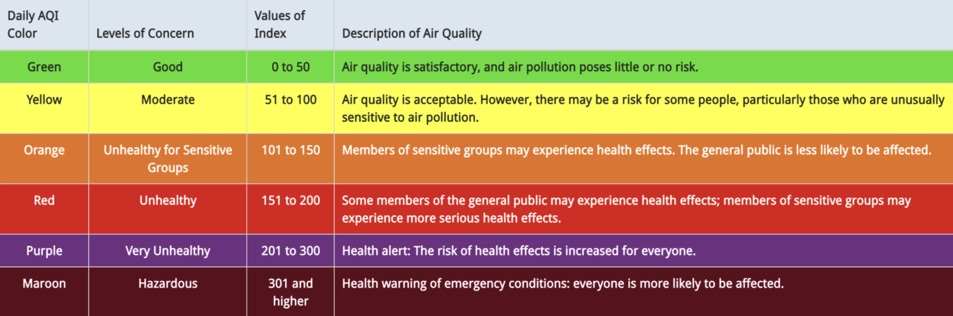
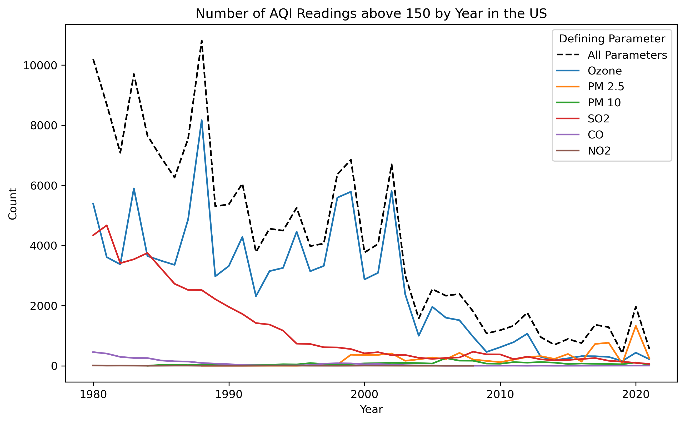
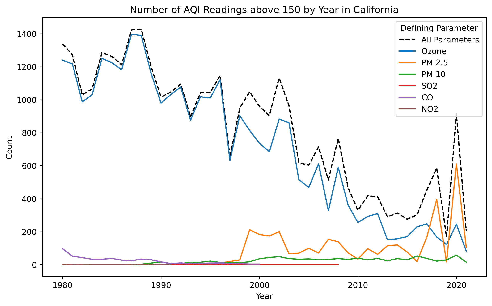
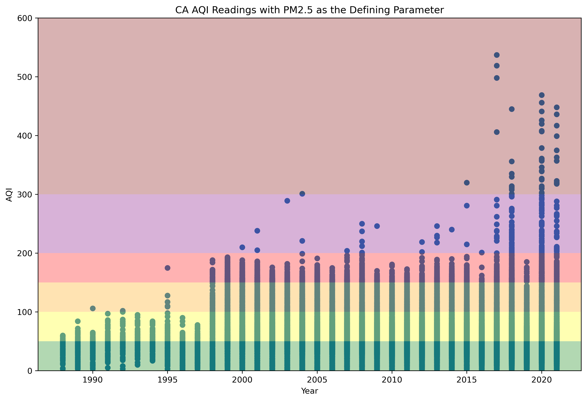

## Authors

- Felicia Cruz, UC Santa Barbara (feliciamcruz@bren.ucsb.edu) <br>
- Steven Cognac, UC Santa Barbara (scognac@bren.ucsb.edu) <br>
- Grace Lewin, UC Santa Barbara (glewin@bren.ucsb.edu) <br>

## Purpose

Air quality serves as an important indicator of human health and the environment. Under the Clean Air Act, U.S. the Environmental Protection Agency (EPA) established National Ambient Air Quality Standards (NAAQS) for five common air pollutants: ozone, particulate matter (PM2.5 and PM10), sulfur dioxide, carbon monoxide, and nitrogen dioxide. Combined, these pollutants form the U.S. Air Quality Index (AQI) for reporting air quality.

The purpose of this project is to assess how air quality in the United States has changed over time from 1980 to 2020. We will use daily Air Quality Index (AQI) data by US county and metropolitan areas for our analysis. This data is made available by the US EPA and is freely accessible. 


## Dataset Description

We use pre-generated data files in .csv format from the **US EPA** for Daily AQI by County which can be found here: https://aqs.epa.gov/aqsweb/airdata/download_files.html#AQI

### _Dataset Characteristics_
The data include daily AQI readings for each year from January 1, 1980 through May 5, 2021.  The Daily AQI by County dataset includes observations for all 50 states plus the District of Columbia, Mexico, Virgin Islands, Canada, Guam, and Puerto Rico. 

Data of interest is AQI. The six defining parameters that contribute to AQI are Ozone, CO, NO2, SO2, PM 2.5, and PM 10.
Daily summary AQI recordings include:
1) The aggregate of all sub-daily measurements taken at the monitor.
2) The single sample value if the monitor takes a single, daily sample (e.g., there is only one sample with a 24-hour duration). In this case, the mean and max daily sample will have the same value.

To calculate AQI, the concentration of each pollutant in the air is measured and converted into a number running from zero upwards by using a standard index or scale. The calculated number for every pollutant is termed as a sub-index. The highest sub-index for any given hour is recorded as the AQI for that hour or aggregated per day. AQI runs from 0 to 500. The higher the AQI value, the greater the level of air pollution and the greater the health concern. The pollutant with the highest concentration over a 24-hour period and which corresponds to the highest sub-index is referred to as the 'Defining Parameter.'
Here is a breakdown of the different categories.


### _Data Artifacts_

- In exploring the data, not all counties included for every state. 
- Data coverage is meant to be daily averages; however, there is missing data for some days in some counties. 
- Breaks in data are not consistent.
- **Extreme Values** overview
     - US EPA AQI scale ranges from 0 to 500; however, some values are greater than 500 which indicates extremely hazardous conditions.
     - In exploring the AQI observations greater than 500, we noticed all the observations defining parameter was PM2.5 or PM10.
     - Looking at the dates and locations, this is likely due to wildfires as opposed inaccurate data.

For more information on how AQI is calculated please visit: https://www.airnow.gov/sites/default/files/2020-05/aqi-technical-assistance-document-sept2018.pdf


## Dataset Input/Output 

### Import Packages


```python
import pandas as pd
import numpy as np
import matplotlib.pyplot as plt
import datetime
```

```python
aqi.to_csv("aqi_us.csv")
```

### Part 1. AQI Trends (1980-2021)

We are interested in exploring the trends in air quality from 1980-2021, specifically how each pollutant contributes to AQI readings over time. We do this by finding the number of air quality readings above 150 in each year, separated by the defining parameters for easy comparison.

We further this analysis to see if California follows the same trend as the US. Since California has extreme fire seasons and many big cities – both which negatively affect air quality – we have chosen California as a focal point to explore local patterns of air quality.

Understanding long term trends in air quality can be useful for many cases. Federal officials, such as in the EPA, as well as local government officials tasked with improving air quality must know which pollutant is most responsible for lowered air quality. By separating the data as we do below, they can evaluate which pollutant needs to be reduced the most to improve the overall air quality of the region. This analysis can also benefit health workers. By understanding the local trends in air quality, they can better understand some the health challenges their patients may be presenting with.

#### Format Data


```python
# format date as datetime
aqi['Date']=pd.to_datetime(aqi['Date'], format = '%Y-%m-%d')

# convert Category column to category data type
aqi['Category']=aqi.Category.astype('category') 

# convert object to integer
aqi['AQI'] = pd.to_numeric(aqi['AQI'])
```


```python
# check data types 
aqi.dtypes
```


    State Name                           object
    county Name                          object
    State Code                           object
    County Code                          object
    Date                         datetime64[ns]
    AQI                                   int64
    Category                           category
    Defining Parameter                   object
    Defining Site                        object
    Number of Sites Reporting            object
    dtype: object


```python
# subset data for readings in the unhealthy range and above (greater than 150)
aqi_unhealthy = aqi[aqi['AQI'] > 150]
```

#### AQI counts for the US > 150 


```python
# subsets for each parameter for above 150 
aqi_ozone_unhealthy = aqi_unhealthy[aqi_unhealthy['Defining Parameter'] == 'Ozone']
aqi_pm25_unhealthy = aqi_unhealthy[aqi_unhealthy['Defining Parameter'] == 'PM2.5']
aqi_pm10_unhealthy = aqi_unhealthy[aqi_unhealthy['Defining Parameter'] == 'PM10']
aqi_so2_unhealthy = aqi_unhealthy[aqi_unhealthy['Defining Parameter'] == 'SO2']
aqi_co_unhealthy = aqi_unhealthy[aqi_unhealthy['Defining Parameter'] == 'CO']
aqi_no2_unhealthy = aqi_unhealthy[aqi_unhealthy['Defining Parameter'] == 'NO2']
```


```python
# counts for each subset 

counts_aqi_unhealthy = aqi_unhealthy.groupby('year').size().reset_index(name='count')
counts_ozone_unhealthy = aqi_ozone_unhealthy.groupby('year').size().reset_index(name='count')
counts_pm25_unhealthy = aqi_pm25_unhealthy.groupby('year').size().reset_index(name='count')
counts_pm10_unhealthy = aqi_pm10_unhealthy.groupby('year').size().reset_index(name='count')
counts_so2_unhealthy = aqi_so2_unhealthy.groupby('year').size().reset_index(name='count')
counts_co_unhealthy = aqi_co_unhealthy.groupby('year').size().reset_index(name='count')
counts_no2_unhealthy = aqi_no2_unhealthy.groupby('year').size().reset_index(name='count')
```


```python
# plot the number of AQI Readings above 150 by Year in the US

plt.plot(counts_aqi_unhealthy['year'], counts_aqi_unhealthy['count'],
         label = 'All Parameters', ls = 'dashed', color = 'black')
<<<<<<< HEAD
plt.plot(counts_ozone_unhealthy['year'], counts_ozone_unhealthy['count'],
         label = 'Ozone')
plt.plot(counts_pm25_unhealthy['year'], counts_pm25_unhealthy['count'],
         label = 'PM 2.5')
plt.plot(counts_pm10_unhealthy['year'], counts_pm10_unhealthy['count'],
         label = 'PM 10')
plt.plot(counts_so2_unhealthy['year'], counts_so2_unhealthy['count'],
         label = 'SO2')
plt.plot(counts_co_unhealthy['year'], counts_co_unhealthy['count'],
         label = 'CO')
plt.plot(counts_no2_unhealthy['year'], counts_no2_unhealthy['count'],
         label = 'NO2')

ax.legend(title = 'Defining Parameter')
plt.title('Number of AQI Readings above 150 by Year in the US')
plt.xlabel('Year')
plt.ylabel('Count')
```
    

    

From this line graph, we can see that air quality in the US since the 80s has generally improved. There have been some spikes, however, and in recent years it seems that PM 2.5 contributes significantly to these spikes in the number of AQI readings above 150. 

#### AQI counts for CA AQI > 150 

    

    


When looking at California's AQI trends, we can see that it generally follows the same negative trend in AQI readings above 150 that the entire US does. However, it does spike in recent years. These spikes appear to be due to increases in AQI readings above 150 due to PM 2.5 as the defining parameter. 

#### AQI counts for CA AQI where PM 2.5 is the defining parameter 


```python
# subset all data for CA and PM2.5 and make new column for year
aqi_ca = aqi[aqi['State Name'] == 'California']
aqi_ca_pm25 = aqi_ca[aqi_ca['Defining Parameter'] == 'PM2.5']
aqi_ca_pm25['Year'] = pd.DatetimeIndex(aqi_ca_pm25['Date']).year
```


```python
# plot the CA AQI Readings with PM2.5 as the Defining Parameter

fig, ax = plt.subplots(figsize = (12,8), dpi = 300)

ax.axhspan(0, 50, facecolor='green', alpha=0.3)
ax.axhspan(50, 100, facecolor='yellow', alpha=0.3)
ax.axhspan(100, 150, facecolor='orange', alpha=0.3)
ax.axhspan(150, 200, facecolor='red', alpha=0.3)
ax.axhspan(200, 300, facecolor='purple', alpha=0.3)
ax.axhspan(300, 600, facecolor='maroon', alpha=0.3)

plt.scatter(aqi_ca_pm25['Year'], aqi_ca_pm25['AQI'])
plt.ylim(0,600)
plt.title("CA AQI Readings with PM2.5 as the Defining Parameter")
plt.xlabel("Year")
plt.ylabel("AQI")
```

    

    
When filtering for all AQI readings above 150 with PM 2.5 as the defining parameter, we can see that there is a very clear uptick in high AQI readings. Before 2000, there were very few readings above 150, but over time readings in the "Unhealthy", "Very Unhealthy", and "Hazardous" thresholds have become much more abundant. Additionally, between 2015 and 2021 we see very high readings above 300, showing how AQI readings have worsened in addition to more abundant unhealthy readings in general. 

One possible explanation for the increased hazardous AQI readings due to PM 2.5 since 2015 is that California's wildfire season has progressively gotten worse each year. 2017 and 2020 have the highest readings. The 2017 season was the most destructive wildfire season on record at the time, with 1.2 million acres burned. The largest fire in the 2017 season was the Thomas Fire in Santa Barbara County, which was California's largest modern wildfire at the time. In 2020, 4.2 million acres were burned, more than 4% of the state's land, making 2020 the largest wildfire season recorded in California's modern history. The August Complex Fire alone burned more than 1 million acres, making it the first "gigafire" on record.  

After looking at air quality trends in the US and in California, we can see that air quality in general has seemed to get better depite some recent spikes largely due to PM 2.5. For further analysis, it would be interesting to see if high AQI readings follow seasonal patterns each year. We have speculated that the recent spikes in hazardous AQI readings due to PM 2.5 could be due to large wildfire events, but further analysis would be needed to confirm this. 


