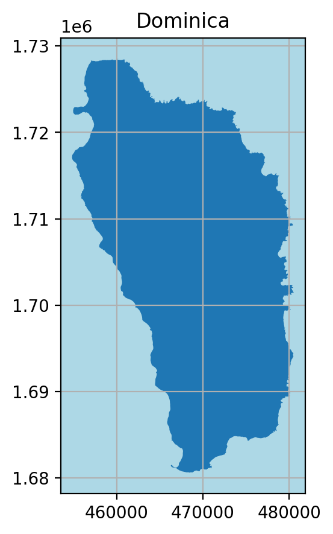
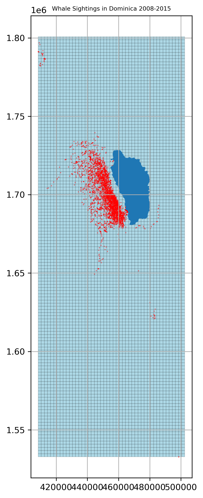
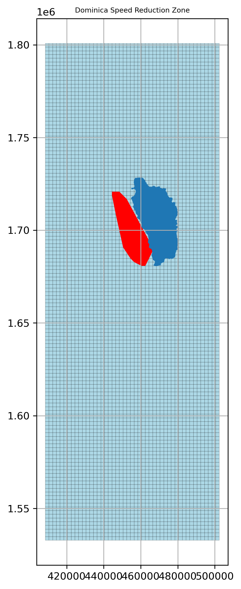

## Protecting Whales from Ships 

HW 3

Felicia Cruz & Kristin Gill 

2021-11-16


```python
import pandas as pd
import numpy as np 
import matplotlib.pyplot as plt
import geopandas as gpd
import shapely.geometry
```

## Dominica Outline


```python
# read in Dominica file and project to correct crs

dominica = gpd.read_file("data/dominica")
dominica.crs

dominica = dominica.to_crs("EPSG:2002")
dominica.crs
```


    <Projected CRS: EPSG:2002>
    Name: Dominica 1945 / British West Indies Grid
    Axis Info [cartesian]:
    - E[east]: Easting (metre)
    - N[north]: Northing (metre)
    Area of Use:
    - name: Dominica - onshore.
    - bounds: (-61.55, 15.14, -61.2, 15.69)
    Coordinate Operation:
    - name: British West Indies Grid
    - method: Transverse Mercator
    Datum: Dominica 1945
    - Ellipsoid: Clarke 1880 (RGS)
    - Prime Meridian: Greenwich


```python
# plot Dominica outline

fig, ax = plt.subplots(figsize=(5, 5), dpi=200)
ax.grid(True)
ax.set_facecolor('lightblue')

dominica_plot = dominica.plot(ax = ax)
ax.set_title("Dominica")
```


    Text(0.5, 1.0, 'Dominica')


    

    


## Whale Sightings Data 


```python
whale_sightings = gpd.read_file("data/sightings2005_2018.csv")
```

### Create grid


```python
# set geometry and correct crs 

whale_geoms = gpd.points_from_xy(whale_sightings['Long'], whale_sightings['Lat'], crs = "EPSG:4326")

whale_with_geoms = whale_sightings.set_geometry(whale_geoms)

whale_with_geoms = whale_with_geoms.to_crs("EPSG:2002")
```


```python
whale_with_geoms.total_bounds
```


    array([ 408480.65208369, 1532792.74594092,  498500.30495702,
           1796964.39970292])


```python
# making the grid

xmin, ymin, xmax, ymax = whale_with_geoms.total_bounds

# Grid cell size
length = 2000
width = 2000

col = list(np.arange(xmin, xmax + width, width))
row = list(np.arange(ymin, ymax + length, length))

# making a polygon from the corner points
def make_cell(x, y, cell_size):
    ring = [
        (x, y),
        (x + cell_size, y),
        (x + cell_size, y + cell_size),
        (x, y + cell_size)
    ]
    cell = shapely.geometry.Polygon(ring)
    return cell

# making the cells 
cells = []
cell_size = 2000
for x in col:
    for y in row:
        cell = make_cell(x, y, cell_size)
        cells.append(cell)
        
grid = gpd.GeoDataFrame({'geometry': cells}, crs=2002)
```


```python
# plotting the grid

fig, ax = plt.subplots(figsize = (10,10), dpi = 300)
ax.grid(True)

grid.plot(ax = ax, facecolor = "lightblue", edgecolor = "black", lw = 0.1)
whale_with_geoms.plot(ax = ax, color = "red", markersize = 0.05)
dominica.plot(ax = ax)

ax.set(xlabel = "",
       ylabel = "")
ax.set_title("Whale Sightings in Dominica 2008-2015", fontsize = 7)

# plt.setp(ax.set_xticks([]), ax.set_yticks([]))
plt.show()
```


    

    


### Extract Whale Habitat 


```python
# spatially join the data
join = grid.sjoin(whale_with_geoms, how = "inner")

# count the rows, which would be the points within the cells
grid['count'] = join.groupby(join.index).count()['index_right']

# include only counts greater than 20
over_20 = grid[grid['count'] > 20]

# unary union
over_20_union = over_20.geometry.unary_union

over_20_convex_hull = over_20_union.convex_hull

speed_reduction_zone = gpd.GeoDataFrame(geometry = gpd.GeoSeries(over_20_convex_hull))
```


```python
# plotting the speed reduction zone
fig, ax = plt.subplots(figsize = (10,10), dpi = 300)
ax.grid(True)

grid.plot(ax = ax, facecolor = "lightblue", edgecolor = "black", lw = 0.1)
speed_reduction_zone.plot(ax = ax, color = "red", markersize = 0.05)
dominica.plot(ax = ax)

ax.set(xlabel = "",
       ylabel = "",
       title = "")
ax.set_title("Dominica Speed Reduction Zone", fontsize = 7)
#plt.setp(ax.set_xticks([]), ax.set_yticks([]))
plt.show()
```


    

    


## Vessel Data


```python
vessel_data = gpd.read_file("data/station1249.csv")
```


```python
# set geometries and use correct crs 

points_vessels = gpd.points_from_xy(vessel_data['LON'], vessel_data['LAT'], crs = "EPSG:4326")

vessel_data_geom = gpd.GeoDataFrame(vessel_data, geometry = points_vessels)

vessel_data_geom = vessel_data_geom.to_crs("EPSG:2002")
```


```python
# getting TIMESTAMP in datetime format 

vessel_data_geom["TIMESTAMP"] = pd.to_datetime(vessel_data_geom["TIMESTAMP"])
vessel_data_geom.dtypes 
```


    field_1              object
    MMSI                 object
    LON                  object
    LAT                  object
    TIMESTAMP    datetime64[ns]
    geometry           geometry
    dtype: object


### Calculate distance and speed 


```python
# spatially intersect the vessel data with the speed reduction zone

reduction_zone_mask = vessel_data_geom.within(speed_reduction_zone.loc[0, 'geometry'])

vessels_within_zone = vessel_data_geom.loc[reduction_zone_mask]
```


```python
# sort vessels df by MMSI and Timestamp
vessels_within_zone = vessels_within_zone.sort_values(by=['MMSI', 'TIMESTAMP'])

# shift data frame
vessels_within_zone_shift = vessels_within_zone.shift(1)

# join original with shift to have both locations in one row
joined_vessels_within_zone = vessels_within_zone.join(vessels_within_zone_shift,
                                                       how = "left",
                                                       lsuffix = "start",
                                                       rsuffix = "end")

# drop rows with mismatching MMSI
joined_vessels_within_zone = joined_vessels_within_zone[joined_vessels_within_zone["MMSIstart"] == joined_vessels_within_zone["MMSIend"]]
```


```python
# add geometry

joined_vessels_within_zone = joined_vessels_within_zone.set_geometry("geometrystart")
joined_vessels_within_zone = joined_vessels_within_zone.set_geometry("geometryend")
```


```python
# CALCULATIONS

# distance
joined_vessels_within_zone['distance_meters'] = joined_vessels_within_zone['geometryend'].distance(joined_vessels_within_zone['geometrystart'])

# time
joined_vessels_within_zone['time'] = joined_vessels_within_zone['TIMESTAMPstart'] - joined_vessels_within_zone['TIMESTAMPend']

# time minutes
joined_vessels_within_zone['time_minutes'] = joined_vessels_within_zone['time']/np.timedelta64(1,'m')

# average speed
joined_vessels_within_zone['speed_meters_min'] = joined_vessels_within_zone['distance_meters']/joined_vessels_within_zone['time_minutes']

# time at 10 knots
joined_vessels_within_zone['time_10knots'] = joined_vessels_within_zone['distance_meters']/308.67

# difference betweeen time it actually took and how long it would have taken at 10 knots
joined_vessels_within_zone['time_difference'] = joined_vessels_within_zone['time_10knots'] - joined_vessels_within_zone['time_minutes']

joined_vessels_within_zone['over_0'] = joined_vessels_within_zone['time_difference'] >=0 
```


```python
# Find all values of time_difference that are above 0 and add them up 

fast_vessels = joined_vessels_within_zone[joined_vessels_within_zone['over_0'] == True]
fast_vessels['time_difference'].sum() 

# 40,140.31 minutes = 669 hours = 27.88 days
```


    40140.306780090905


27.88 days is the extra time it would take for shipping due to the speed reduction zone in our identified whale habitat. 


```python

```
